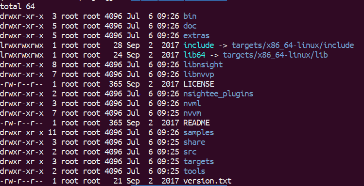

Tensorflow v1.8 (for GPU) installed via the ```pip``` package manager requires that the Nvidia toolkit v9.0 be installed. These instructions outline the steps required to properly install the necessary requirements.

# System Config Verification
Update and upgrade system
```
sudo apt-get update
sudo apt-get upgrade
```

Check if you have a supported GPU. A list of supported GPUs can be found [here](https://developer.nvidia.com/cuda-gpus)
Run the following command to display your Nvidia GPUs
```
lspci | grep -i nvidia
```
Check if your system is 64-bit, which is required by the CUDA toolkit.
```
uname -m && cat /etc/*release
```
The first line of the output should be ```x86_64```, indicating a 64-bit architecture. Note down your operating system version.

Install the Linux Kernel headers by running the following commands
```
sudo apt-get install linux-headers-$(uname -r)
```


# Removing Previous CUDA installations
In order to ensure a clean installation, we must first remove other versions of the CUDA toolkit installation. Run the following commands to uninstaill and remove all other versions:
```
sudo apt-get purge nvidia*
sudo apt-get purge cuda
sudo apt-get purge libcudnn6
sudo apt-get purge libcudnn6-dev
sudo apt-get autoremove
sudo apt-get autoclean
sudo rm -rf /usr/local/cuda*
```
NOTE: zsh requires that you issue the command ```sudo apt-get purge "nvidia*"``` instead.

# Installing the CUDA toolkit 
Navigate to the [CUDA Toolkit Download Page](https://developer.nvidia.com/cuda-90-download-archive) and select the options for your operating system. 
Download the ```deb (network)``` installer. (NOTE: I was successful with this. Other installers may work, but are untested)
Run the following commands to install the toolkit:
```
sudo dpkg -i cuda-repo-ubuntu1604_9.0.176-1_amd64.deb
sudo apt-key adv --fetch-keys http://developer.download.nvidia.com/compute/cuda/repos/ubuntu1604/x86_64/7fa2af80.pub
sudo apt-get update
sudo apt-get install cuda=9.0.176-1
```
NOTE: These commands are for Ubuntu 16.04. For 17.10, run ```sudo dpkg -i cuda-repo-ubuntu1710_9.2.88-1_amd64.deb``` instead.

Verify that the installation was successful by navigating to ```/usr/local/cuda-9.0```. the directory structure should be similar to the one shown below.



Reboot your computer to load all drivers.

# Installing cuDNN SDK v7.1
Navigate to the [CUDNN homepage] and click download cuDNN. Click ```Download cuDNN v7.1.4 (May 16, 2018), for CUDA 9.0``` and select your platform. 
Run the following commands to install cuDNN:
```
tar -xf cudnn-9.0-linux-x64-v7.1.tgz
sudo cp -R cuda/include/* /usr/local/cuda-9.0/include
sudo cp -R cuda/lib64/* /usr/local/cuda-9.0/lib64
```


# Updating Path Variables
Add the CUDA toolkit to ```$PATH``` and ```$LD_LIBRARY_PATH```
For Bash:
```
echo 'export PATH=/usr/local/cuda-9.0/bin${PATH:+:${PATH}}' >> ~/.bashrc
echo 'export LD_LIBRARY_PATH=/usr/local/cuda-9.0/lib64${LD_LIBRARY_PATH:+:${LD_LIBRARY_PATH}}' >> ~/.bashrc
source ~/.bashrc
sudo ldconfig
```
For zsh:
```
echo 'export PATH=/usr/local/cuda-9.0/bin${PATH:+:${PATH}}' >> ~/.zshrc
echo 'export LD_LIBRARY_PATH=/usr/local/cuda-9.0/lib64${LD_LIBRARY_PATH:+:${LD_LIBRARY_PATH}}' >> ~/.zshrc
source ~/.zshrc
sudo ldconfig
```
Run ```nvidia-smi``` to verify the installation.
