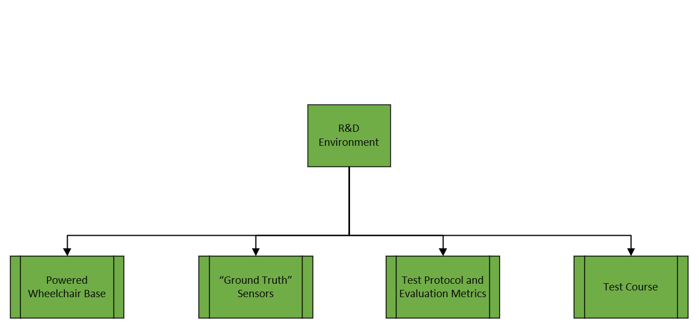
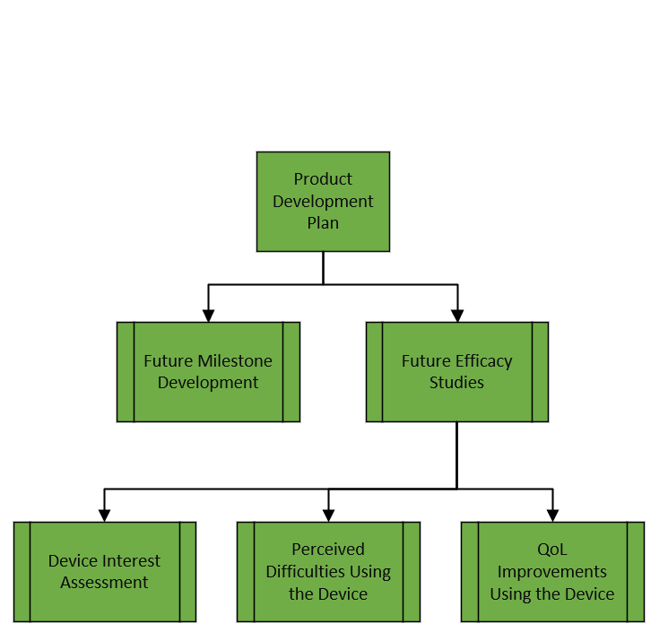

## Submitted Discovery Grant Application

`The Co-Chair. A collaborative navigation, steering, and fitness assistant for powered wheelchair users.`

The Co-Chair is an interactive **“plug and play” add-on for any powered wheelchair** that augments traditional controls by collaborating with the user to provide intelligent, semi-autonomous functionality.    

The operation of powered wheelchairs (PWC) require both manual and mental dexterity. The user must avoid curbs and drop-offs, important since nearly three-fourths of wheelchair-related injuries are caused by tips and falls, while also navigating terrain and avoiding collisions. **The Co-Chair will increase the users physical and mental health by avoiding these accidents and reducing the cognitive load associated with operating a powered wheelchair.** 

This will be accomplished by combining low cost **RGB-D “3D” cameras** and an **IMU near the joystick** with a **smartwatch** to have knowledge of both the environment[1][2] and the user’s physiological state[3] so that **inferences about the user intent can lead to contextually aware decisions** allowing the Co-Chair to adaptively update the amount of shared control with the user. 

## Feedback

>In general, the assessors felt that the idea was very feasible and that your idea of using low-costs technologies for your navigation system would make it even more affordable, and that was welcomed. They also felt like the application and the plans were well developed.
>
>The key weaknesses of your application were: minimal details on the development of the "watch" algorithms, worries around the use of RGB-D cameras that may lead to navigational errors (as they tend to have outdoor limitations). Some assessors also mentioned that similar products were already being developed by a number of laboratories and design projects, and that it was unclear how innovative it would be.  
>
>Also, as you know, the main assessment criteria for the Discovery Award was the level of financial need, and it was felt that offering the award to other applicants would have a bigger impact when it came to supporting their entry to the main Challenge.
>
>In general, as you can see, your application was well received and I hope this will encourage you to apply for the Main Challenge, deadline 15th August 2018.

## Awarded Applications

Project Name | Category | Group
-------------|----------|------
*Highly Mobile Robotic Exoskeleton for Upright Mobility* | Exoskeleton | The Institute for Human & Machine Cognition (IHMC), USA
*Exomotion: the most advanced, full mobility wearable robotic exoskeleton* | Exoskeleton | Human in Motion Robotic Inc., Canada
*Gaze-based semi-autonomy for wheelchairs* | Semi-Autonomy, Gaze Detection | Brain and Behavior Lab, Imperial College London, UK
*Foot ++* | Rehabilitation/Therapy | Foot++, USA
*Towards Life with Standing Mobility Unlimited* | Powered Wheelchair, Exoskeleton | Artificial Intelligence Laboratory, University of Tsukuba, Japan
*Intelligent Hoverboard for Wheelchair Balancing (WCHB)* | Manual Addon | Erik Kondo, USA
*Physiology-Adaptive and Computer Vision-Assisted Soft Exoskeletons to Support Independent Living across the Continuum of Rehabilitation* | Exoskeleton | Biomechatronics and Intelligent Robotics Lab, City University of New York, City College/University of Texas Medical School/TIRR Memorial Hermann, USA
*Enabling Independent Mobility and Social Play for Young Children with Mobility Impairments* | Pediatric Powered Mobility | University of Washington & Oregon State University, USA
*Self-balancing wheel for wheelchairs with automatic hub gear box* | Manual Addon | Aesthel, Germany
*Wheelchair with IS COG / Data capture* | Self-Balancing Manual Wheelchair | Phoenix Instinct, UK

### Gaze-based Semi-autonomy for Wheelchairs

[Mobility Unlimited Page](https://mobilityunlimited.org/people/brain-and-behavior-lab)

[Group Website](http://wp.doc.ic.ac.uk/bbl/)

The team aims to develop a low-cost gaze-based intention decoding interface that can be installed on any existing joystick operated electrical wheelchair. Our technology will allow users to drive-by-eye, without the need to interact with a “user interface,” simply navigating as the users imagine where they want to go. This allows users to give high-level driving intentions (“get me out of the room”) instead of having to fiddle around with complicated manoeuvres, these are handled by a semi-autonomous AI for navigation. The system consists of a laptop and off-the-shelf sensors, leading to a low-cost upgrade for any powered wheelchair.

## Finalist Application 

### Addressing Feedback

>The key weaknesses of your application were: minimal details on the development of the "watch" algorithms

* Nuke the watch
* ~~Double down on the watch~~

>worries around the use of RGB-D cameras that may lead to navigational errors (as they tend to have outdoor limitations)

* FLIR camera?
* Alternatives?

>Some assessors also mentioned that similar products were already being developed by a number of laboratories and design projects, and that it was unclear how innovative it would be.

* Emphasize innovative components 
* Develop a better product development plan than a university can achieve

### Finalist Assessment Criteria

> When selecting the Discovery Awardees and the Finalists, entrants will be assessed and selected on the basis of their **potential** against the judging criteria.
>
> When the winner is selected, Finalists will have to **demonstrate** how they meet the judging Criteria.

[https://www.mobilityunlimited.org/handbook/what-were-looking#paragraph-132](https://www.mobilityunlimited.org/handbook/what-were-looking#paragraph-132)

* Innovation
* Insight and Impact
* Functionality and Usability
* Quality and Safety
* Market Potential and Affordability

### Updates To Product Idea

Remove the watch component, leaving a "smart joystick" module with varying degrees of semi-autonomy. Include an additional camera facing the user for eye-gaze detection for use in contextually changing the degree of autonomy as well as an alternative control input. 

#### Goal Behavior

* Maintain a vision-based map of the surrounding area

* Identify people, curbs, ramps, and drop offs

* Perform obstacle avoidance and social path planning

* Enable varying degrees of shared control, or allow dynamically changing amount of shared control

* Selectable Control inputs (joystick, eye-gaze)

* "Universal" controller for mulitple PWC devices

#### Onboard Sensors and Hardware

1. Forward-facing rgb camera
2. Forward-facing flir camera
3. User-facing rgb camera
4. IMU
5. Jetson TX2 and small footprint mount

#### Challenges

* Plug-N-Play on different chairs requires adapting to different chairs (dynamics/kinematics) and different users.

* For good HRI, need some sort of feedback to the user (auditory, haptic, vibration, etc)

* Social interation and social pathplanning

#### Prototypes

[Gaze Tracker](../gaze-tracking.md)  
[Roomba Mobile Platform](../roomba.md)  
[Autochair Platform](../autochair.md)  
[Gazebo Simulation](../gazebo-simulation.md)  

#### User Feedback Options

* Todd-the-Quadfather

* Gleason

* Tim Shaw

