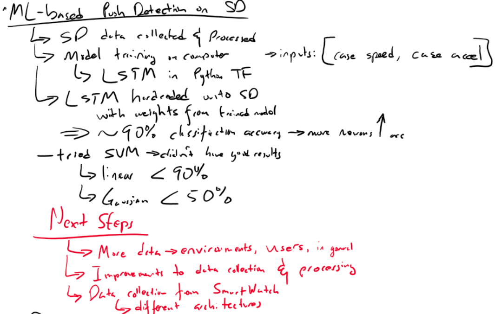
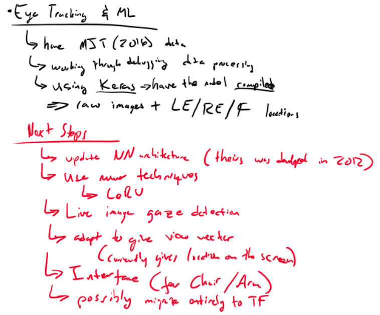
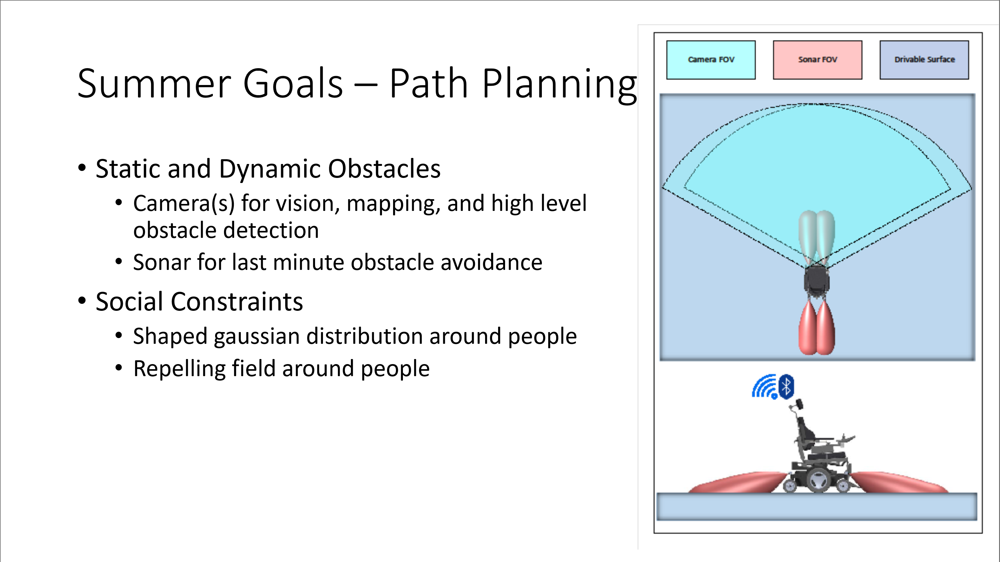
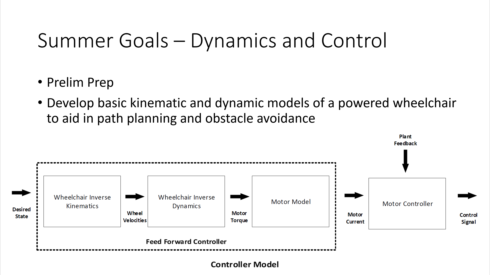
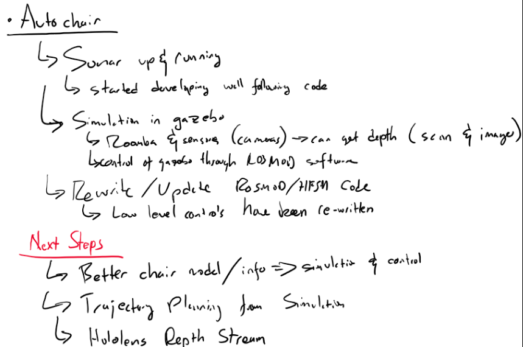
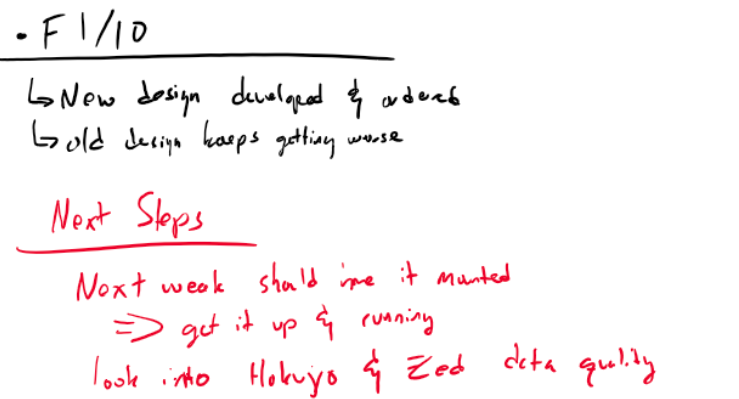
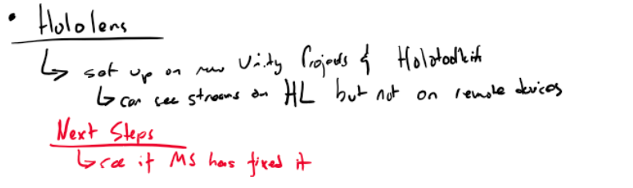

Projects:

 - Eval App
 - Pushtracker App
 - Other Apps
 - Pushtracker Hardware
 - Smartdrive
 - Eye Gaze
 - Autochair
 - Sim
 - Ballbot
 - F1/10 Testbed
 - Roomba Testbed
 - Gazebo Simulation
 - Hololens
 - Alternative Controls
 - Activity Recognition
 - Learning-Enabled Systems
 - Robotic Arm
 - Computer Vision
 - SLAM
 - Sensor Fusion
 - Modeling Infrastructure
 - Rosmod Development Platform
 - Machine Learning
 - Others...
 

# Apps

# Pushtracker

Project | Related Work
--------|----------------
Smartwatch | Apps, Sensor Fusion, Machine Learning, learning-enabled systems

# Smartdrive
 
Project | Related Work
--------|----------------
Induction Motor | Sim
Balldrive | Sim, ballbot
Braking | Alternative Controls,
Steering | Alternative Controls
Push Detection | ML, Sensor Fusion, Activity Recognition
Other... | Other...

 
# Eye Gaze

Project | Related Work
-------|----------------
CNN, ML| Machine Learning, Sensor Fusion
Novel Control interfaces | Alternative Controls, ML
Hardware | Computer Vision

# Autochair

Project | Related Work
--------|----------------
Safety (sonar, drop-off, walls) | Machine Learning, Sensor Fusion
Perception (semantic mapping, image segmentation, person identification, intent-recognition) | ML, Sensor Fusion, Computer Vision, 
Control (kinematics, dynamics, model-predictive control) | modeling infrastructure, ML, learning-enabled systems
Path planning with social constraints | ml, modeling infrastructure, computer vision, SLAM, learning-enabled systems
Activity/Intent recognition | ML, Activity Recognition, learning-enabled system
Shared Control | ml, learning-enabled system, alternative controls, Activity/Intent Recognition
Unity Update | Modeling Infrastructure
Rosmod Update | Rosmod Development Platform

# SIM

Project | Related Work
--------|----------------

# Ballbot

Project | Related Work
--------|----------------

# F1/10 Testbed

Project | Related Work
--------|----------------
Reactive Obstacle Avoidance | les, ml
Mapping | SLAM, ml, sensor fusion

# Roomba Testbed

Project | Related Work
--------|----------------
Path planning with social constraints | ml, modeling infrastructure, computer vision, SLAM, learning-enabled systems
Sensor Testing and Development | sensor fusion, modeling infrastructure

# Gazebo Simulation

Project | Related Work
--------|----------------
Dynamics and Controls Development| ml, les, sensor fusion
Behavior Testing | modeling infrastructure, rosmod development platform

# Hololens

Project | Related Work
--------|----------------

# Alternative Controls

Project | Related Work
--------|----------------

# Activity Recognition

Project | Related Work
--------|----------------

# Learning-Enabled Systems

Project | Related Work
--------|----------------

# Robotic Arm

Project | Related Work
--------|----------------

# Computer Vision

Project | Related Work
--------|----------------

# SLAM

Project | Related Work
--------|----------------

# Sensor Fusion

Project | Related Work
--------|----------------

# Modeling Infrastructure

Project | Related Work
--------|----------------

# Rosmod Development Platform

Project | Related Work
--------|----------------

# Machine Learning

Project | Related Work
--------|----------------

 

